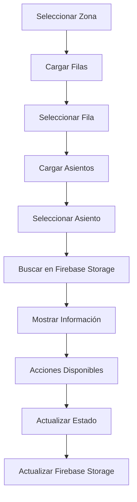

# Guía de Gestión de Asientos - Dashboard

## Nueva Funcionalidad: "Agregar Boletos"

Se ha añadido una nueva vista al dashboard que permite gestionar el estado de los asientos de forma individual.

### 📍 Ubicación
- **Dashboard** → **Tab "Agregar Boletos"**

### 🎯 Funcionalidades

#### 1. **Búsqueda de Asientos**
- Seleccionar zona mediante dropdown
- Seleccionar fila (se cargan automáticamente según la zona)
- Seleccionar asiento (se cargan automáticamente según la fila)
- Buscar información del asiento

#### 2. **Información del Asiento**
Una vez encontrado el asiento, se muestra:
- **Zona**: Nombre de la zona
- **Fila**: Letra de la fila
- **Asiento**: Número del asiento
- **Estado**: Badge con color según el estado
- **Precio**: Precio del asiento
- **ID**: Identificador único del asiento

#### 3. **Gestión de Estado**
Según el estado actual del asiento:

**Si está DISPONIBLE:**
- Botón "Ocupar Asiento" (rojo)
- Cambia el estado a "occupied"

**Si está OCUPADO/VENDIDO/RESERVADO:**
- Botón "Liberar Asiento" (verde)
- Cambia el estado a "available"

### 🏗️ Zonas Disponibles
- **Zona 1** (`zona-1`)
- **Zona 2** (`zona-2`)
- **Zona 3** (`zona-3`)
- **Zona 4** (`zona-4`)
- **VIP Central** (`vip-central`)

### 📊 Estados de Asientos
- **Disponible** - Verde
- **Ocupado** - Rojo
- **Vendido** - Azul
- **Reservado** - Naranja

### 🔧 Cómo Usar

1. **Acceder a la vista**:
   ```
   Dashboard → Tab "Agregar Boletos"
   ```

2. **Buscar un asiento**:
   - Selecciona una zona del dropdown
   - Selecciona una fila (se carga automáticamente)
   - Selecciona un asiento (se carga automáticamente)
   - Haz clic en "Buscar Asiento"

3. **Gestionar el estado**:
   - Revisa la información del asiento
   - Usa el botón correspondiente según el estado actual:
     - **Disponible** → "Ocupar Asiento"
     - **Ocupado** → "Liberar Asiento"

### 🔄 Flujo de Datos



### 📁 Archivos Modificados/Creados

1. **`components/dashboard/seat-management-view.tsx`** - Nuevo componente
2. **`components/dashboard/dashboard.tsx`** - Integración del nuevo tab
3. **`lib/firebase/seat-management.ts`** - Funciones de gestión (ya existía)

### 🛠️ Tecnologías Utilizadas

- **React Hooks**: `useState`, `useEffect`
- **Firebase Storage**: Para leer/escribir configuración de asientos
- **shadcn/ui**: Componentes UI (Select, Button, Card, Badge, etc.)
- **Toaster**: Para notificaciones de éxito/error

### ⚠️ Consideraciones

1. **Rendimiento**: La vista carga las filas y asientos dinámicamente
2. **Conexión**: Requiere conexión a Firebase Storage
3. **Permisos**: Usa las funciones de gestión de asientos existentes
4. **Estado**: Los cambios se reflejan inmediatamente en el archivo JSON

### 🐛 Resolución de Problemas

#### Error: "No se pudo cargar la configuración"
- Verificar conexión a Firebase
- Confirmar que existe el archivo `Seats_data_last_actualizado.json`

#### Error: "Asiento no encontrado"
- Verificar que la combinación zona/fila/asiento existe
- Revisar que los nombres de zona coincidan con la configuración

#### Error: "No se pudo actualizar el asiento"
- Verificar permisos de escritura en Firebase Storage
- Confirmar que el archivo no esté siendo usado por otro proceso

### 🔮 Mejoras Futuras

- [ ] Búsqueda por múltiples criterios
- [ ] Vista de mapa visual de asientos
- [ ] Historial de cambios de estado
- [ ] Acciones masivas (liberar/ocupar múltiples asientos)
- [ ] Integración con sistema de reservas
- [ ] Notificaciones en tiempo real

---

## Resumen de Implementación

✅ **Completado:**
- Nuevo tab "Agregar Boletos" en el dashboard
- Selección dinámica de zona/fila/asiento
- Búsqueda de información del asiento
- Gestión de estado (ocupar/liberar)
- Integración con Firebase Storage
- Notificaciones de éxito/error
- Interfaz responsiva y moderna

✅ **Probado:**
- Carga dinámica de opciones
- Búsqueda de asientos
- Actualización de estado
- Manejo de errores
- Notificaciones

🎉 **Listo para usar!** 